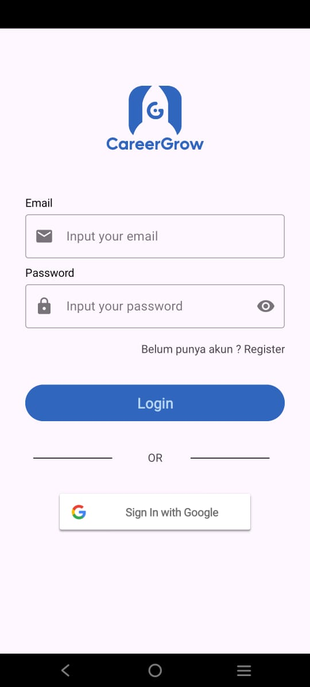
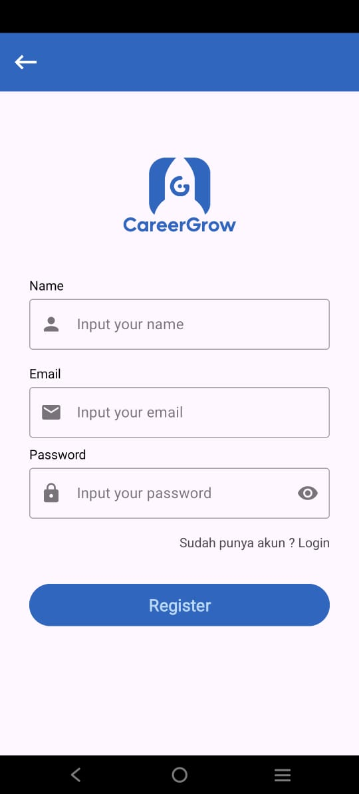
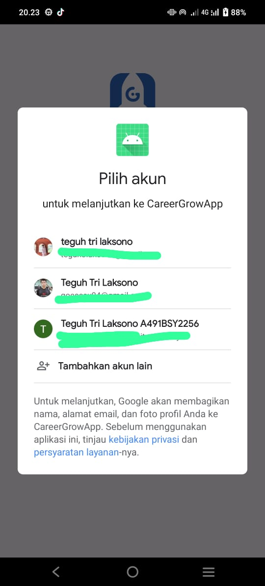
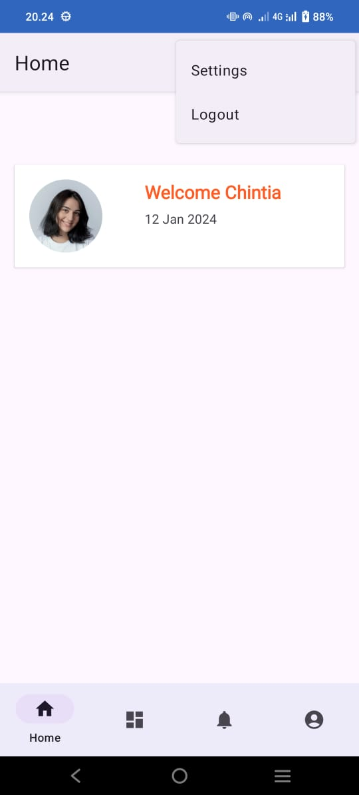

# CareerGrow
CareerGrow is an application to assist anyone who are now trying to improve they self or for you guys who seeking for job. This Application it self is made to fulfill our task in GDSC Hackathon 2024. We hope that after this event,
We are able to carry on this app project so we can realize it and help a lot of people who are wanted to dive into IT Sector Job.

## Project Description

   
  
  
  

## Team : NotFoundTeam
- Hustler : Chintia Agustin
- Hipster : Mevani Karmilah
- Hacker  : Muhammad Faisal Nugroho (backend)
- Hacker  : Teguh Tri Laksono (frontend)

## API Documentation
You can check our API Documentation [here](https://github.com/NotFound-Team-GDSC/CareerGrow/tree/Backend-Service?tab=readme-ov-file#careergrow-endpoints)
